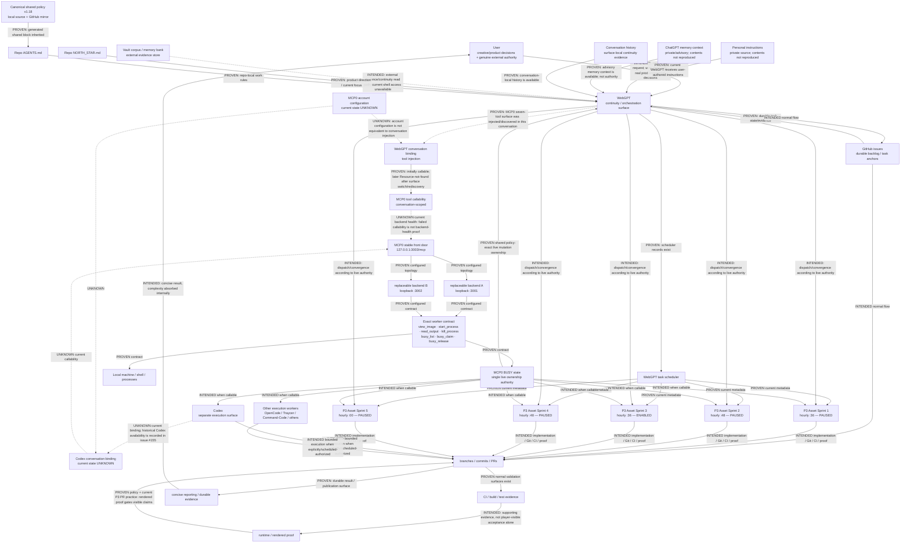

# WebGPT-led Assistant Stack Architecture — 2026-08-27

Status vocabulary:

- **PROVEN** — observed directly in current live/config/repository evidence.
- **INTENDED** — explicitly required by user or current policy, but not fully proven end-to-end in the observed state.
- **UNKNOWN** — the current state was not observable from the available evidence. It must not be inferred from another surface.

## State separation that must not be collapsed

| State | Current observation | Classification |
|---|---|---|
| MCP0 account configuration | Not directly observable from this work session | **UNKNOWN** |
| MCP0 injected/discoverable in this WebGPT conversation | Exact seven-tool surface was discovered | **PROVEN** |
| MCP0 callable in this WebGPT conversation | `busy_list` succeeded earlier; after switching connector surfaces, rediscovery still listed tools but direct calls returned `Resource not found` | **PROVEN observed transition** |
| MCP0 backend/front-door health at the later failure | No matching server telemetry was inspected; callability failure alone cannot establish health | **UNKNOWN** |
| Current Codex conversation binding | Not inspected from Codex itself | **UNKNOWN** |
| Historical Codex MCP0 availability during the #155 triggering incident | Recorded by #155 | **PROVEN historical evidence** |

## Five timed worker records

The scheduler currently contains exactly these five named P3 Asset Sprint records. “Five timed workers” does **not** currently mean five simultaneously active workers.

| Worker | Effective hourly minute | Current state | Current scope |
|---|---:|---|---|
| P3 Asset Sprint 1 | :36 | Paused | Convergence-first asset placement: finish/prove/merge already-implemented placement work before adding more |
| P3 Asset Sprint 2 | :48 | Paused | Same convergence-first scope as Sprint 1 |
| P3 Asset Sprint 3 | :36 | Enabled | Bounded production-map asset-placement increment using existing P3/Tiny3D assets and normal proof path |
| P3 Asset Sprint 4 | :48 | Paused | Same bounded asset-placement scope as Sprint 3 |
| P3 Asset Sprint 5 | :00 | Paused | Same bounded asset-placement scope as Sprint 3 |

Recent scheduler metadata proves last-run timestamps but does not expose attributable outcome artifacts for these five records. A current GitHub PR with `PROVENANCE=chatgpt` is therefore **not** enough to attribute it to a specific Sprint worker without a run/automation identity.

## Current architecture findings

1. **P3 ownership contradiction — PROVEN.** The shared v1.18 block says MCP0 BUSY is the sole live ownership authority and GitHub BUSY titles are projections only. P3’s repo-local “Go work on p3” loop later says the GitHub title “is the claim” and MCP `busy_*` is only a mirror. Both cannot be authoritative simultaneously.
2. **LowVRAM ownership contradiction — PROVEN.** The shared block says MCP0 BUSY is sole live ownership authority; the LowVRAM repo-local section separately names a Traycer production-lanes YAML as the live lane/ownership authority.
3. **Five-worker naming vs live capacity — PROVEN.** Five named scheduler records exist, but only Sprint 3 is enabled at this observation.
4. **Worker-result attribution gap — PROVEN.** The live scheduler exposes worker metadata/last-run time, while current GitHub evidence commonly uses generic `PROVENANCE=chatgpt`; no reliable Sprint-1…5 outcome linkage was observed.
5. **Conversation binding can fail independently of backend health — PROVEN.** This WebGPT conversation first called MCP0 successfully, then after switching connector surfaces could still rediscover the seven tools while direct calls returned `Resource not found`. Current backend health remained unobserved.

Related hardening umbrella: [regression-research #125](https://github.com/organicoverlords/regression-research/issues/125).
