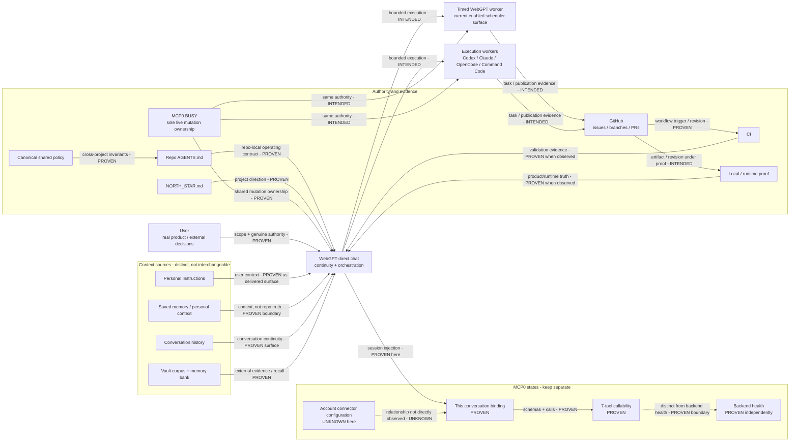

# WebGPT-led assistant stack architecture

Observed 2026-08-27 for regression-research issue #155. Companion direction: #125. This is a descriptive scaffold, not a new control plane.

Material connections use three labels:

- **PROVEN** - directly observed in current source, configuration, logs, GitHub history, scheduler state, or tool behavior.
- **INTENDED** - explicitly required by current user/repo architecture, but not established as universally true on every surface.
- **UNKNOWN** - the available evidence does not establish the connection without inference.

The standalone Mermaid source is [`assistant-stack-architecture.mmd`](assistant-stack-architecture.mmd).

## What each layer owns

**User.** Product direction, creative/fun choices, destructive intent, spending/publication, credentials, and other genuine external authority. Routine Git, BUSY, worker, CI, connector, retry, and recovery mechanics stay inside the stack. **INTENDED**, consistent with #125/#155.

**WebGPT direct chat.** The intended continuity/orchestration surface: preserve the bounded request, combine the current conversation with permitted context, select an available execution route, reconcile evidence, and report the result. This exact conversation has live MCP0 callability. Universal cross-conversation tool injection is **UNKNOWN**.

**Context sources.** Personal Instructions, saved memory/personal context, conversation history, and the Vault corpus are separate. They may inform work, but none substitutes for current user instruction or live repo/runtime truth. Exact private contents are intentionally excluded. **PROVEN boundary / delivery details vary by surface**.

**Execution workers.** Timed WebGPT, Codex, Claude, OpenCode, and Command Code perform bounded implementation/recovery work. They do not become a second policy, ownership, or product authority merely because they can execute. **INTENDED**, with current activity evidenced below.

**Repo control plane.** Shared policy provides cross-project invariants; repo `AGENTS.md` adds local rules; `NORTH_STAR.md` states direction; GitHub carries task/publication evidence; CI and runtime proof validate claims. **PROVEN**.

**BUSY.** MCP0 BUSY is the sole live shared-mutation ownership authority. Issues, PRs, branches, process state, and worker names can show activity but do not create another lock. **PROVEN** by current shared policy and #125 fixtures.

## Timed WebGPT worker topology - current live state

The live scheduler query for #155 proves **one enabled hourly worker** at observation time: the bounded P3 asset-placement worker running on the `:36` phase in `Europe/Helsinki`. Scheduler metadata proves its schedule/scope and invocation state, not semantic completion of its last run.

The issue text's earlier five-worker premise is therefore **not current topology**. Historical/deleted worker definitions are not treated as live architecture and are intentionally omitted from the current-state map. Whether the present one-worker state is temporary or desired is **UNKNOWN**; #155 records the state rather than rearming or redesigning it.

## MCP0 - contract and boundary states

The current worker-visible MCP0 contract is exactly seven tools: `view_image`, `start_process`, `read_output`, `kill_process`, `busy_list`, `busy_claim`, and `busy_release`. Current backend source and this conversation's live namespace agree. **PROVEN**.

Do not collapse these four states:

| State | Current finding |
|---|---|
| Account connector configuration | **UNKNOWN** - not directly inspected here |
| This WebGPT conversation binding/injection | **PROVEN** - MCP0 namespace is callable |
| Tool schemas/callability | **PROVEN** - seven-tool contract works in this conversation |
| Backend service health | **PROVEN independently** - local MCP listeners/backends answer health probes |

The exact platform-to-listener transport hop is **UNKNOWN** in the final map. Earlier and later probes disagree about whether the current WebGPT path terminates on the legacy listener or the newer front-door path, and no end-to-end request identity was correlated across that boundary. That disagreement is evidence, not a reason to add another routing layer in #155.

Local Codex CLI configuration does not list MCP0, while recent Codex histories contain references to shell-MCP work. Therefore **Codex CLI -> MCP0 configuration is PROVEN absent in the inspected CLI snapshot; arbitrary Codex session injection remains UNKNOWN**. Installation, backend health, and session injection are separate facts.

## Executor activity measured from logs + GitHub

This is a timestamped workload snapshot, not a leaderboard. The counting window starts 2026-08-25 00:00 EEST and is frozen at **2026-08-27 10:57:52 EEST**; Codex was still active, so these numbers must not be read as a completed Aug 25-27 total. Local event schemas differ, coverage differs, and token accounting is not comparable across clients; token totals are deliberately not used as a work score.

| Surface | Local activity observed in the timestamped snapshot | Regression-research GitHub outcome observed | What it means |
|---|---:|---|---|
| Codex | 27 session logs; 3,673 explicit tool calls; 318 task starts / 302 completes / 10 aborts | PRs #140 and #145 merged; 2 commits across 9 changed files | High activity, two small landed changes |
| Claude | 5 sessions with in-window events; 875 tool calls | PRs #22 and #26 merged; 4 commits across 4 changed files | Lower call volume, same merged-PR count |
| OpenCode | 5 sessions; 512 tool parts | PRs #35 and #36 merged; 2 commits across 10 changed files | Moderate activity, same merged-PR count |
| Command Code | 4 recent session logs; 33 tool calls | No Command-Code-prefixed branch/PR found in the current repo search | Very light observed footprint; not proof of zero useful work elsewhere |

The useful architectural conclusion is small: **route bounded work to available executors, but judge value from accepted artifacts and evidence rather than tool-call volume.** The three larger surfaces each landed two bounded PRs despite large differences in local activity. Nothing in this measurement justifies another dispatcher, scoring service, telemetry dashboard, or worker hierarchy.

## GigStack lesson: keep scaffolding local and malleable

Historical regression evidence shows a recurring failure mode: project-local `WORKER REPORT`, `REVIEW CARD`, progress/status schemas, gates, receipts, and volatile MCP state leaked into general behavior. The result was more ceremony and worse ordinary assistance, even when the original project-specific mechanisms were useful.

For this architecture map that means:

1. Project-specific reporting and proof conventions stay in the project/workflow that needs them; they are not promoted into a global conversation protocol.
2. Volatile worker schedules, route health, tool counts, and port topology are timestamped evidence, not durable global authority.
3. GitHub remains task/publication/evidence transport; it does not become a second BUSY system.
4. The map records existing boundaries. It does not create new gates, lifecycle states, dashboards, daemons, memory schemas, or orchestration frameworks.
5. The user gets the result and genuine decisions, not maintenance of the scaffold.

This is the main anti-GigStack constraint for #155: **preserve the good mechanisms where they already work, keep their boundaries explicit, and leave them replaceable.**

## Authority matrix

| Question | Current authority | Status |
|---|---|---|
| What does the user want now? | Current user request | **PROVEN** |
| Who may mutate a shared scope now? | Live MCP0 BUSY claim | **PROVEN** |
| Cross-project operating invariants? | Canonical shared policy | **PROVEN** |
| Repo-local operating rules? | Current repo `AGENTS.md` | **PROVEN** |
| Project direction? | Current `NORTH_STAR.md` + explicit user priority | **PROVEN** |
| Code/publication state? | Current GitHub/default branch/PR/commit state | **PROVEN when inspected** |
| Did validation pass? | Observed tests/CI/runtime evidence for the exact artifact | **PROVEN when observed** |
| Historical behavior? | Versioned evidence/Vault corpus with provenance | **PROVEN as history, not live authority** |
| Persistent context writes? | Explicit user authorization | **INTENDED / policy-proven** |

## Personal Instructions, bootstrap, and durable-memory provenance

Do not collapse these into one authority surface:

1. **Recovered good-state text is historical evidence, not live configuration.** The strongest word-for-word Aug 25 boundary is preserved in [`02 Evidence/issue122/2026-08-25_122229_EEST_pre-repair-memory-block.txt`](../02%20Evidence/issue122/2026-08-25_122229_EEST_pre-repair-memory-block.txt) and [`02 Evidence/issue122/2026-08-25_123749_EEST_repaired-memory-block.txt`](../02%20Evidence/issue122/2026-08-25_123749_EEST_repaired-memory-block.txt), with lineage and temporal limits in [`2026-08-25_1226-1237_rule-provenance.md`](../02%20Evidence/issue122/2026-08-25_1226-1237_rule-provenance.md). The observed sequence is the 12:30 missing-capability-guard failure, repair between 12:30:19 and 12:37:49, then fresh-chat execution success from 12:40 onward. The exact persistence surface that activated the behavior remains unproven; do not rewrite this as a proven Personal Instructions-vs-Saved-Memory mechanism.
2. **The durable behavioral kernel is smaller than the recovered blob.** #122's surviving direct-assistant controls support: start the bounded task immediately; reconcile live state; try a capability before declaring it absent; bind explicit user correction above derived interpretation; route around local failure without abandoning the bounded scope; match proof to the task's acceptance claim; and keep worker success separate from direct-assistant health. Dated project state, transient connector names, tactical fallbacks, and assistant-authored platform explanations remain historical evidence unless independently promoted.
3. **Current Personal Instructions and ChatGPT saved memory are live user configuration.** Their maintained bootstrap pointer should converge on the single command `python C:\Users\Lauri\Desktop\vault\tools\stack_atlas.py bootstrap-glance`. Repository evidence does not prove the account UI copy is current; verify that surface separately when available.
4. **Fresh-chat continuity uses the compact Vault/Atlas orientation minimap, not a behavior dump.** `bootstrap-glance` returns stable paths, concise operating/debugging defaults, useful follow-up commands, 20 recent memory titles, PC/worker status, and live MCP callers/activity. It is not product truth, a planner, or a replacement for current repo/runtime inspection. The retired `/Agent Bootstrap/chatgpt-bootstrap.json` remains a legacy/recovery tombstone. After the glance, follow the relevant live owner; use targeted Vault history only when past work matters.
5. **Assistant-authored durable Vault memories preserve the user's actual words.** When the user explicitly asks to record a memory, use `python tools/memory_bank.py record`; `source_messages` and, when applicable, `turn_task` preserve the relevant user wording verbatim, while assistant interpretation/confidence/state remain separate and auditable. This is the durable Vault record; it must not be confused with a verified mutation of ChatGPT's product-level saved-memory store.

## Normal flow

1. WebGPT preserves the bounded request and reads applicable live authority/state. **PROVEN/INTENDED**.
2. Before shared mutation, it checks and claims the exact MCP0 BUSY scope. **PROVEN**.
3. It works directly or delegates a bounded implementation step to an available executor. **INTENDED**.
4. The executor uses existing repo/tooling seams instead of creating parallel control machinery. **INTENDED**.
5. Exact changed-area tests, CI, and required runtime/product proof establish the claim. **PROVEN when observed**.
6. GitHub publishes the accepted artifact; BUSY is released; WebGPT returns a concise outcome and only genuine remaining decisions. **INTENDED**.

## Degraded flows

- **One WebGPT conversation lacks MCP0 binding:** capability loss is local to that conversation until stronger evidence says otherwise. Read-only/independent work can continue; no GitHub title or local lock becomes replacement BUSY authority. **INTENDED / #125-covered**.
- **MCP backend or public route fails:** distinguish binding, callability, transport, and backend health. Continue unrelated capabilities; do not restart or redesign healthy layers by inference. **INTENDED**.
- **Timed worker unavailable:** another unclaimed actor may do the bounded work after re-reading current authority. Worker names are not ownership. **INTENDED**.
- **CI/runtime proof unavailable:** implementation may advance where meaningful, but the unavailable acceptance claim stays **UNKNOWN** until its required evidence exists.
- **Stale context conflicts with live truth:** current user instruction/live state wins; history stays provenance, and persistent context is not silently rewritten. **PROVEN policy**.

## Current findings / unknowns

- **PROVEN:** only one timed WebGPT worker is currently enabled; the five-worker premise is stale as a current-state claim.
- **PROVEN:** this conversation has the seven-tool MCP0 binding and backend health is independently observable.
- **UNKNOWN:** account-level connector configuration and the exact external transport hop for this conversation.
- **PROVEN/UNKNOWN:** MCP0 is absent from the inspected local Codex CLI MCP list; other Codex session injection is not inferred either way.
- **PROVEN:** executor activity volume varies by orders of magnitude while recent merged-PR counts do not; activity volume is not acceptance.
- **PROVEN:** shared policy is one logical authority even though generated physical copies exist in repos; synchronization drift remains a possible failure mode.

## What the user never has to manage

The user should not need to manage BUSY claims, connector fallbacks, worker rearming, branch selection, CI plumbing, stale projections, tool-call budgets, or proof bookkeeping for ordinary work. The stack should absorb those mechanics and ask only for real product/creative choices, destructive intent, spending/publication, credentials, or external authority it cannot supply.

## Source inventory - observed 2026-08-27

- `organicoverlords/regression-research#122` - forensic reconstruction of the good-state behavior boundary; implementation/live-context changes remain #125 work.
- `02 Evidence/issue122/2026-08-25_122229_EEST_pre-repair-memory-block.txt`, `2026-08-25_123749_EEST_repaired-memory-block.txt`, and `2026-08-25_1226-1237_rule-provenance.md` - exact recovered text and provenance for the pre/post repair boundary.
- `organicoverlords/regression-research#155` - architecture scope and acceptance criteria.
- `organicoverlords/regression-research#125` - single BUSY authority, capability-local degradation, instruction provenance, explicit memory-write authorization, and whole-stack acceptance.
- `02 Evidence/issue155-live-stack-evidence-20260827.md` - live MCP/scheduler/control-plane evidence plus the worker activity sample.
- Current repo/shared `AGENTS.md` and `NORTH_STAR.md` - policy/authority boundaries.
- Current MCP0 source + live seven-tool namespace + local health probes - contract/callability/backend evidence; no credentials recorded.
- `%USERPROFILE%/.codex/sessions/...` - Codex JSONL event/tool counts; last cumulative token counters inspected but not used as cross-client score.
- `%USERPROFILE%/.claude/projects/...` - timestamp-filtered Claude JSONL tool-use counts.
- `%USERPROFILE%/.local/share/opencode/opencode.db` - timestamp-filtered OpenCode session/part/tool counts.
- `%USERPROFILE%/.commandcode/projects/...` - recent Command Code JSONL tool-use counts.
- GitHub PRs #22, #26, #35, #36, #140, #145 - landed executor work used for outcome comparison.
- `90 Raw Transcripts/share-6a86831f-6b54-83ed-8209-a1f4bf4e3caf.txt` and `02 Evidence/deleted_memory_recovery_2026-08-20.md` - evidence of project-local reporting/gate leakage and volatile state becoming global behavior.

No ChatGPT memory, Personal Instructions, worker schedule, MCP configuration, or shared policy was changed while producing this map.
