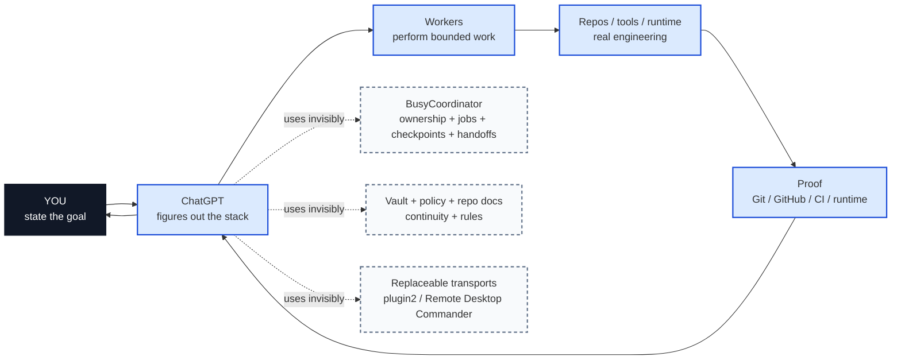
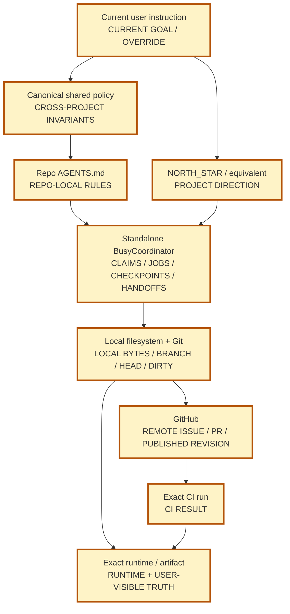
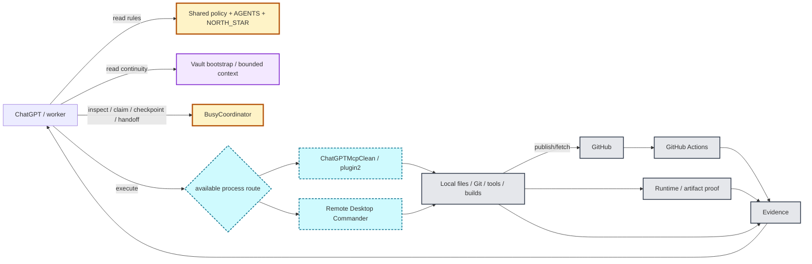
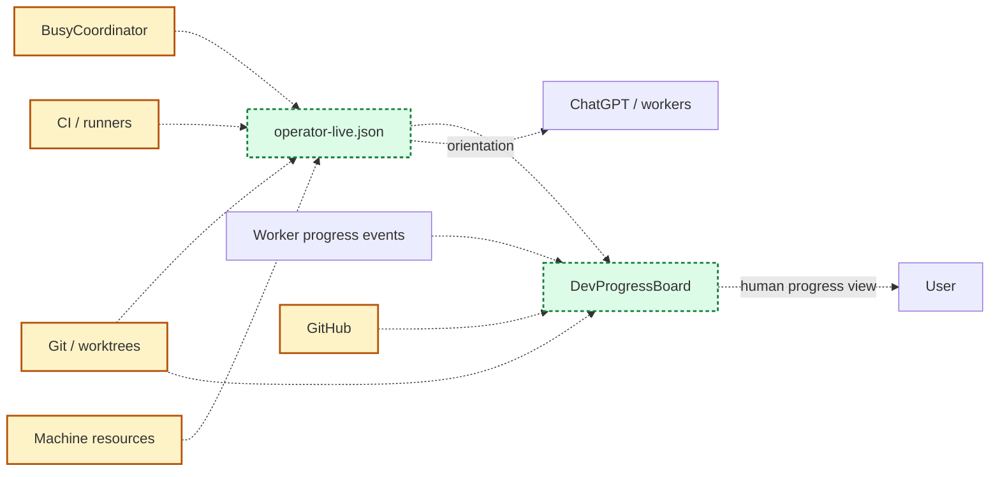
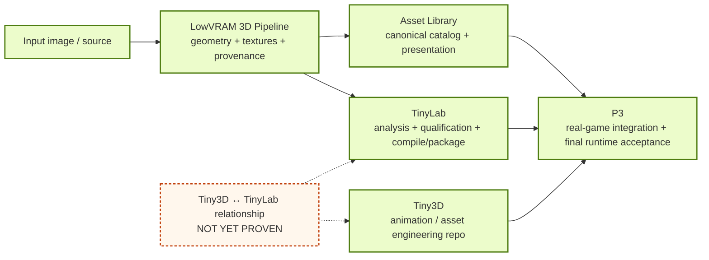

# Assistant stack — human map

Status: **descriptive map, not authority**. Current user instruction and the named source/live authority always win if this document disagrees.

This is the map to look at when asking **“what are all these pieces, and who owns what?”** The companion [capability index](assistant-stack-capability-map.md) has exact paths, commands, boundaries, live-overlay notes, and the #271 duplicate-design regression.

## 1. What you should have to think about

**Target:** during normal use, you mainly see the top loop. The lower boxes are implementation details unless something genuinely requires your decision.

## 2. Authority map — who is allowed to answer which question

This is a **question-to-owner map**, not one universal precedence chain. BusyCoordinator owns mutation ownership but cannot override Git about the actual HEAD; Git cannot override your current instruction; a stale handoff cannot override any of them.

## 3. Execution map — how work actually gets done

The important split is **authority vs transport**. plugin2 or Remote Desktop Commander can carry a command; neither becomes owner of the work. Scheduler wakeups also do not create mutation ownership.

## 4. Observability map — source versus projection

`operator-live.json` and DevProgressBoard are useful because they **reconcile and display**. They do not write authority back into BusyCoordinator, Git, GitHub, CI, runtime, or project policy.

## 5. Product/data map — what the engineering stack is building

The current DevProgressBoard explicitly models `LowVRAM -> Asset Library + TinyLab -> P3`. Tiny3D is separately present as a live Git repo and animation/asset work surface. The map does **not** invent the Tiny3D/TinyLab relationship.

## 6. Quick ownership lookup

| If you need to know / do... | Go to | Do **not** treat as owner |
|---|---|---|
| What are we doing now? | Current user instruction | memory, old handoff, old issue |
| What rules apply everywhere? | Canonical shared policy | duplicated repo prose |
| What rules apply in this repo? | Current repo `AGENTS.md` | global map / board |
| What direction is this project heading? | `NORTH_STAR.md` / equivalent | worker recency |
| Who owns this mutable scope? | **BusyCoordinator** | branch, process, issue title, scheduler |
| What work is ready/active/blocked? | **BusyCoordinator jobs** | board status / labels |
| Where did this scope leave off? | **BusyCoordinator checkpoint** | a new resume database |
| How is actionable pending work handed off? | **BusyCoordinator `handoff`** | prose-only comment |
| How do we run a local command? | available transport: plugin2 / RDC / shell | transport as ownership |
| What bytes/branch/HEAD are actually local? | filesystem + Git/worktree | GitHub prose / memory |
| What is published remotely? | GitHub | local branch alone |
| Did CI pass this artifact? | exact workflow/run | expected outcome |
| Does it work in the product/runtime? | exact runtime/artifact proof | source inspection alone |
| What should a fresh chat know about behavior? | Vault `bootstrap` | full historical bank |
| What happened historically? | Vault/regression corpus | history as live truth |
| What is the near-live overall status? | `operator-live.json` | projection as authority |
| What should I look at for product progress? | DevProgressBoard | board as coordinator |
| When should a worker wake? | ChatGPT Automations | schedule as work claim |

## 7. Component directory

- **User/current instruction** — owns the current goal and genuine external decisions.
- **ChatGPT direct chat** — orchestrates; consumes authorities and evidence but does not replace them.
- **ChatGPT Automations** — timed recurrence only.
- **Execution workers** — perform bounded engineering under the same authorities.
- **Vault/regression-research** — behavior bootstrap, durable history, regression evidence, fixtures and stack research.
- **ChatGPT PI/saved memory** — separate product context; explicit-write only; not Vault/live repo truth.
- **Canonical shared policy** — one logical owner of cross-project behavioral invariants.
- **Repo `AGENTS.md`** — repo-local operating contract.
- **`NORTH_STAR.md` / equivalent** — project direction and finish line.
- **Standalone BusyCoordinator** — one live owner of claims, jobs, checkpoints, handoffs and recovery.
- **BusyCoordinator canonical store** — `%LOCALAPPDATA%\ChatGPTMcpClean\.state\busy-claims.json`; durable coordinator state, not a file to hand-edit around the coordinator.
- **ChatGPTMcpClean / plugin2** — stable process transport/front door; coordination stays outside it.
- **Remote Desktop Commander** — alternate authorized machine/files/process transport.
- **Local filesystem + Git/worktrees** — local bytes, branch, HEAD, dirty state, commit truth.
- **GitHub** — remote issue/PR/published-revision and workflow record.
- **GitHub Actions / self-hosted runners** — artifact-specific CI evidence.
- **Runtime / Unreal / exact artifact** — actual runtime and user-visible proof when observed.
- **`operator-live.json`** — near-live machine/coordinator/repo/runner projection for orientation.
- **DevProgressBoard** — deterministic human-facing product progress projection.
- **LowVRAM 3D Pipeline** — generator: image/source to geometry, textures and provenance.
- **Asset Library** — canonical production catalog, naming, presentation and view coverage.
- **TinyLab** — analysis/qualification/compilation/package stage as modeled by DevProgressBoard.
- **Tiny3D** — separate observed Git repo for animation/asset engineering; relation to TinyLab remains unresolved.
- **P3** — final game integration and real runtime acceptance.

## 8. The #271 mistake this map must prevent

We proposed a new resume/context concept containing a registry, structured checkpoints and resume packets. Live inspection later showed that BusyCoordinator already had the key resumability machinery: jobs, checkpoints, `snapshot`, `inspect`, `next`, `recover`, and `handoff` creating a resumable ready child job.

So the missing thing was **visibility of an existing capability**, not another runtime system.

Before any future cross-stack component is proposed:

1. name the missing capability as a verb: `handoff`, `checkpoint`, `schedule`, `execute`, `publish`, `validate`, `remember`, `observe`, etc.;
2. use this map to find its current owner;
3. inspect/test the owner before designing anything;
4. if the capability already exists, reuse it;
5. if only its visibility is bad, improve this map/read view;
6. if a real field/command is missing, add the smallest thing at the existing owner;
7. reject any design that creates a second authoritative copy by default.

## 9. Detailed reference

For exact paths, commands, BusyCoordinator contract details, live-overlay observations, known drift, implementation repositories, and unresolved seams, use [assistant-stack-capability-map.md](assistant-stack-capability-map.md). For machine consumption use [assistant-stack-capability-map.json](assistant-stack-capability-map.json).

The standalone overview diagram source is [assistant-stack-capability-map.mmd](assistant-stack-capability-map.mmd).