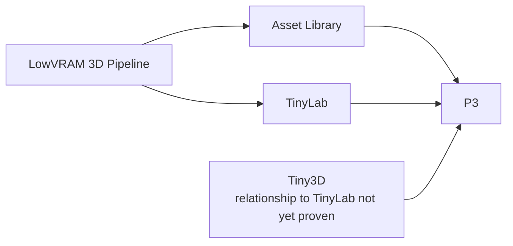

# Assistant stack — user map

Status: **mandatory descriptive orientation, not authority**. Current user instruction and named live/source authorities always win if this map disagrees.

This is the map for the user. It deliberately hides implementation levels. The detailed assistant reference is [`assistant-stack-capability-map.md`](assistant-stack-capability-map.md).

## The whole system

**Normal expectation:** you say what you want once. ChatGPT absorbs the internal mechanics and returns a proven result.

You should not have to choose or repair BusyCoordinator, workers, worktrees, MCP/plugin routes, memory plumbing, CI lanes, Git branches, schedulers, or progress projections during ordinary work.

## The five internal responsibilities

1. **KNOW** — understand your current instruction, applicable rules, relevant continuity, and current live state.
2. **COORDINATE** — avoid duplicate/conflicting mutation and resume existing work instead of recreating it.
3. **EXECUTE** — use an available supported route and do the bounded engineering work.
4. **RECOVER** — handle route/tool/worker failures internally when another safe path exists.
5. **PROVE** — use Git, GitHub, CI, runtime, or artifact evidence appropriate to the claim before reporting success.

## What sits underneath — only when you need to know

| Responsibility | Main internal pieces | What they are for |
|---|---|---|
| KNOW | Library-delivered behavior generated from Vault, Vault memory/policy, shared policy, repo `AGENTS.md`, `NORTH_STAR`, live orientation | Context, rules and current truth |
| COORDINATE | **Standalone BusyCoordinator** | Claims, jobs, checkpoints, handoffs and recovery |
| EXECUTE | Workers + plugin2/ChatGPTMcpClean + Remote Desktop Commander + local tools | Carry out work through replaceable routes |
| RECOVER | Capability routing + checkpoints/handoffs + current live state | Continue safely when one route or worker fails |
| PROVE | Filesystem/Git, GitHub, CI, runtime/artifacts, current/recent Commander-MCP activity | Establish what actually happened; worker activity uses a bounded recent evidence window |

`operator-live.json` and DevProgressBoard are **views**, not authorities. They help humans and assistants see state; they do not get to redefine ownership, Git state, CI truth, runtime truth, or your instruction.

A BusyCoordinator claim tells us who owns a mutation scope; it does **not** prove active work. Worker status uses a just-checked Commander/MCP activity surface and a bounded recent window (normally five minutes): in-flight work or a continuing stream of recent completed work events tied to the scope counts as active, without requiring a child process at the exact sampling instant.

## Product pipeline

The explicit board flow remains `LowVRAM -> Asset Library + TinyLab -> P3`. Tiny3D is a separate observed asset/animation engineering repo feeding P3; its exact relationship to TinyLab remains intentionally unresolved until proven.

## The rule that prevents more #271s

Before anyone adds stack machinery, ask one question: **who already owns this capability?**

If the capability already exists, use it. If a small field/command is genuinely missing, extend the existing owner. If the problem is only visibility, fix the map/read view. Do not create a second authority, database, queue, coordinator, resume system, or synchronized copy by default.

#271 is the regression example: a new resume/context design was proposed before live inspection showed BusyCoordinator already had jobs, checkpoints, `snapshot`, `inspect`, `next`, `recover`, and `handoff`.

## How this map stays current

The compact version of this model is embedded as mandatory `stack_map_glance` reading in the generated Library behavior artifact. Vault remains canonical; the Library artifact is the primary fresh-chat delivery projection and the local Vault bootstrap is fallback.

For stack/architecture/control-plane work, assistants must read the detailed [`assistant-stack-capability-map.md`](assistant-stack-capability-map.md) before designing or mutating the stack.

Repository verification runs `tools/stack_map_guard.py`. If declared stack-defining files change, the same change must refresh both this human map and [`assistant-stack-capability-map.json`](assistant-stack-capability-map.json). Ordinary product/feature changes are deliberately outside that gate.

The map is descriptive. A fresh chat still performs live orientation after behavior delivery, map reading, and bounded memory refresh because dynamic worker, coordinator, repo, CI, machine and runtime state can change without changing the architecture.

## Current convergence program

Recent 2026-08-30 work is one program rather than many unrelated layers:

- #275 made capability ownership discoverable so existing mechanisms are reused.
- #276 restored a deterministic startup sequence instead of making the user recover context manually.
- #279 made behavioral/policy changes auditable rather than silently accumulating.
- #280 locked the bootstrap-failure boundary so continuity trouble degrades locally.
- #281 now makes worker status depend on fresh execution proof; ownership claims/checkpoints no longer count as positive liveness or progress evidence.
- #285 merged the Library-primary delivery boundary: generated Library behavior is primary for fresh chats, while Vault remains canonical/fallback and supplies bounded memory enrichment. Repository merge and external Library publication are separate proof states.
- #288 corrected worker status to a bounded recent Commander/MCP activity window; ownership metadata remains zero-weight for liveness.
- Current P3 workspace-pool work aims to hide physical Unreal workspace/build mechanics behind logical work.

All of these serve the same target: **complexity may exist internally; it should not become user work.**
